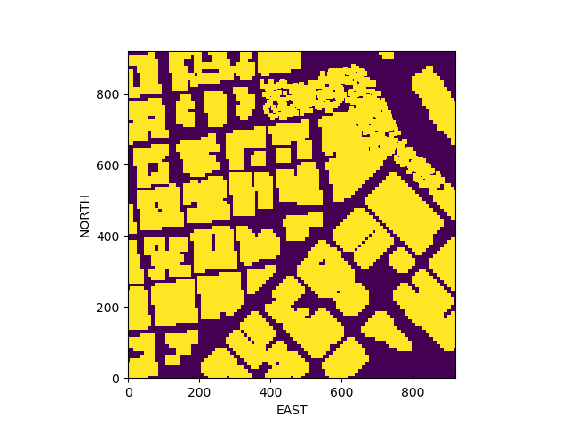
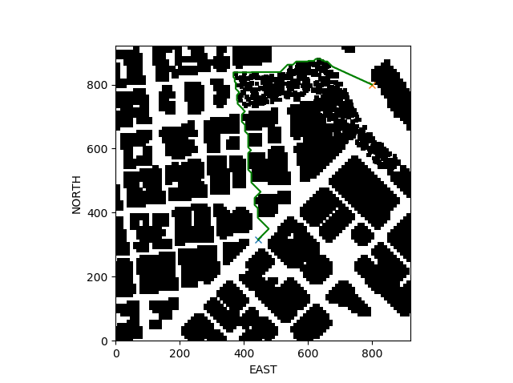
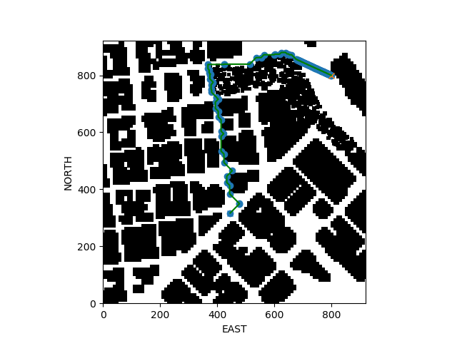

## Project: 3D Motion Planning

---

# Required Steps for a Passing Submission:
1. Load the 2.5D map in the colliders.csv file describing the environment.
2. Discretize the environment into a grid or graph representation.
3. Define the start and goal locations.
4. Perform a search using A* or other search algorithm.
5. Use a collinearity test or ray tracing method (like Bresenham) to remove unnecessary waypoints.
6. Return waypoints in local ECEF coordinates (format for `self.all_waypoints` is [N, E, altitude, heading], where the drone’s start location corresponds to [0, 0, 0, 0].
7. Write it up.
8. Congratulations!  Your Done!

## [Rubric](https://review.udacity.com/#!/rubrics/1534/view) Points
### Here I will consider the rubric points individually and describe how I addressed each point in my implementation.  

---
### Writeup / README

#### 1. Provide a Writeup / README that includes all the rubric points and how you addressed each one.  You can submit your writeup as markdown or pdf.  

You're reading it! Below I describe how I addressed each rubric point and where in my code each point is handled.

### Explain the Starter Code

#### 1. Explain the functionality of what's provided in `motion_planning.py` and `planning_utils.py`
These scripts contain a basic planning implementation that includes...

NO | method | description
--- | --- | ---
1 | plan_path | -read in obstacle info -define a grid for a specific altitude and safety margin around obstacles -define starting & goal points on the grid -run A* to find a path from start to goal -convert path to waypoints -send waypoints to simulator
2 | create_grid | creates a grid representation of a 2D configuration space based on given obstacle data, drone altitude and safety distance arguments
3 | Action | define all actions and assume cost the same
4 | valid_actions | create a list of valid actions given a grid and current node
5 | a_star | A* search algorithm
6 | heuristic | calculate normalized distance between position and global_position

### Implementing Your Path Planning Algorithm

#### 1. Set your global home position
Here students should read the first line of the csv file, extract lat0 and lon0 as floating point values and use the self.set_home_position() method to set global home. Explain briefly how you accomplished this in your code.

After opening the file named `colliders.csv`, I got the first line using `csv.reader()` and `next()`. The latitude and longitude values are parsed and then passed in `self.set_home_position()`.

#### 2. Set your current local position
Here as long as you successfully determine your local position relative to global home you'll be all set. Explain briefly how you accomplished this in your code.

My local position can be obtained using `global_to_local(self.global_position, self.global_home)` function. The local north, east, down info should be assigned onto `self._north`, `self._east`, `self._down` respectively.

#### 3. Set grid start position from local position
This is another step in adding flexibility to the start location. As long as it works you're good to go!

`self.local_position` info is converted into the starting point on the grid by using `north_offset` and `east_offset` returned from `create_grid()`. The following image is the grid obtained from the obstacle map `colliders.csv`.

#### 4. Set grid goal position from geodetic coords
This step is to add flexibility to the desired goal location. Should be able to choose any (lat, lon) within the map and have it rendered to a goal location on the grid.

The position on the grid is randomly chosen. Until it is not an obstacle, random selection is iterated. To do this, `grid.shape` info is employed.

#### 5. Modify A* to include diagonal motion (or replace A* altogether)
Minimal requirement here is to modify the code in planning_utils() to update the A* implementation to include diagonal motions on the grid that have a cost of sqrt(2), but more creative solutions are welcome. Explain the code you used to accomplish this step.

I added 4 actions for diagonal motions. They are `N_E`, `S_E`, `N_W`, and `S_W`. `cost()` is changed to compute `sqrt(2)`. In `valid_actions()`, the obstacle cases for diagonal motions are added.

The following image shows the path generated by an A* algorithm from a starting position to a goal position.

#### 6. Cull waypoints
For this step you can use a collinearity test or ray tracing method like Bresenham. The idea is simply to prune your path of unnecessary waypoints. Explain the code you used to accomplish this step.

The collinearity check is done by using `np.linalg.det()`. In the `prune_path()`, all the waypoints are checked. If the 3 points are in a line, the 2nd point is removed. The 3rd point now becomes the 2nd point and the collinearity check is redone with a new 3rd point on the next iteration. The following image shows the pruned path using a collinearity test.

### Execute the flight
#### 1. Does it work?
It works!

### Double check that you've met specifications for each of the [rubric](https://review.udacity.com/#!/rubrics/1534/view) points.

# Extra Challenges: Real World Planning

For an extra challenge, consider implementing some of the techniques described in the "Real World Planning" lesson. You could try implementing a vehicle model to take dynamic constraints into account, or implement a replanning method to invoke if you get off course or encounter unexpected obstacles.
